# Database Integration between ESP32 and Local Server (XAMPP)

## Overview
Our main task is to send Gas PPM data from the ESP32 to a local server using XAMPP and store the PPM value in the database. Let's see the step-by-step process for this:

### Step 1:
login into XAMPP and go to phpMyAdmin option. Then, click on the ‘new’ option to create a new database by clicking on 'Create database'. Provide a relevant database name 'gas_sensor_data' or something you prefer. Then click on the 'Create' button. 

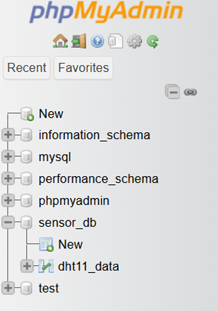

### Step 2:
Then give an appropriate database table name as shown in the below image, 'ppm_data' which is only specified to save the PPM value.  A single database can have multiple tables, but in this example we are using only one table. This table should have three columns. This is because we will get 2 values from the gas sensor (MQ2): PPM and a timestamp to track the data reception. Another should be the ID/SL no of each data. So, the table should have columns: “ID---> sl no.”, “Datetime--->datetime”, and “PPM--->ppm_val”, . Click on “Create” to create the table with these columns.

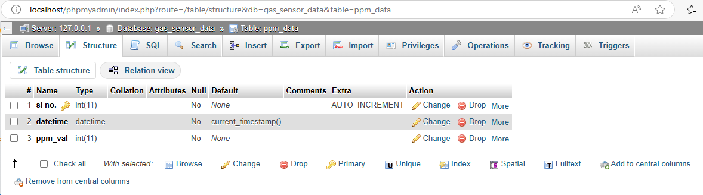

The three column variables are modified as shown in the above image, please follow the above figure for this.

### Step 3:
Now, we want to see if our database can be updated properly using an SQL command! Go to the SQL option and write the following command:
`INSERT INTO ppm_data(ppm_val) VALUES (209)`
Click on the ‘go’ command and check if the data table has a new entry with the specified value. If the SQL command executes successfully, a confirmation message will be displayed.

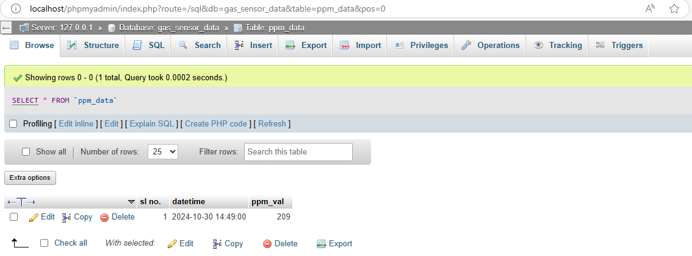

### Step 4:
Next step is to write a PHP script to check whether we can insert fake data into our database through PHP script to make sure everything is working correctly before we start sending real data from the ESP32. 
1. Navigate to the XAMPP installation directory and open the “htdocs” folder.
   `Path: C:\xampp\htdocs`
2. Create a new project folder, e.g., `gas_sensor_esp32`.
3. Create a new PHP file in this folder, e.g., `gas_sensor_php.php`, and open it with any text editor (The final php code is provided in the repository: [PHP Script](code/php_code)). 
4. Write the PHP script to test database insertion. Modify the hostname, username, password and database variable name according to yours. The code should look like this:
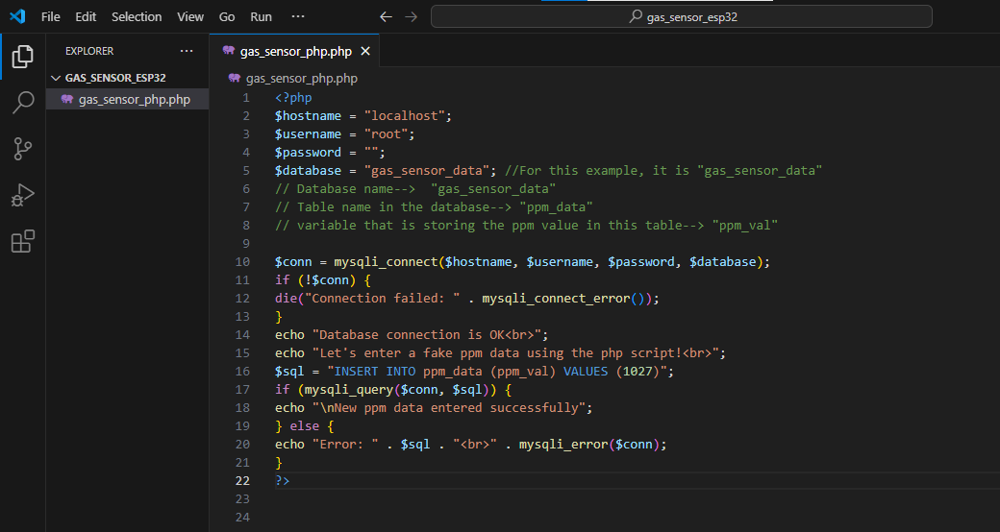

5. Save the file and load it in your browser using `localhost/your_project_folder_name/file_name_with_extension` (e.g., `localhost/gas_sensor_esp32/gas_sensor_php.php`). A message should be shown like the following image below: 
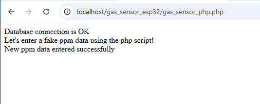

If this shows, then you are succesful at entering dummy data into your actual database in the local server! 

Let's check the database also to see if actually the dummy data 1027 ppm is entered into our database or not!

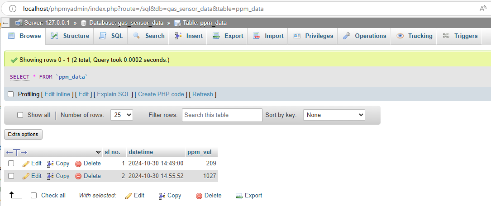
According to the above figure, we observe that '1027' is indeed stored in the database! We are close!

We can also send the PPM value using a variable. For that modify the code according to following image:
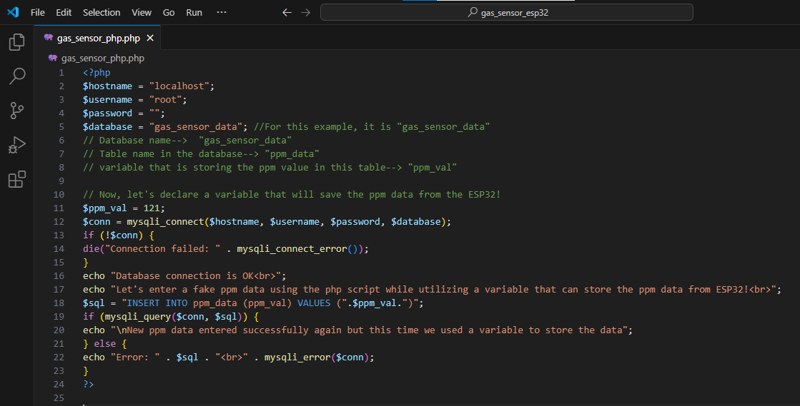
Here, '$ppm_val' is the variable that is storing the PPM value and then it is send to the database. The result is similar:
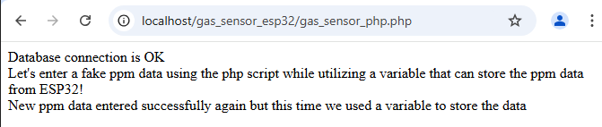
and as we can see that the data '121' is saved successfully into the database:
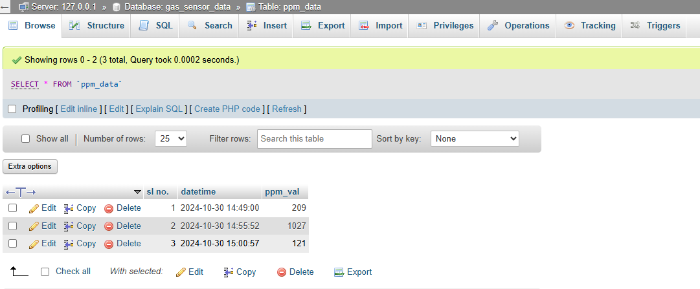

Now, all we need to do is send the PPM value from the ESP32 reading to this '$ppm_val' variable in the php script and we can successfully store the real time PPM data saved into the local server! 
### Step 5:
Now, we shall use the ESP32 main code (esp32_gas_sensor_with_db.ino) to send data to the XAMPP server. This code includes necessary libraries like the Wi-Fi library for connecting to the network and the HTTP client library for sending HTTP requests. We need to define the web server address (IP address of your computer), which you can find using the `ipconfig` command in the command prompt and add this code to the replace the IP address mentioned in this code: "esp32_gas_sensor_with_db.ino". How to determine the IP address of your computer is shown below:
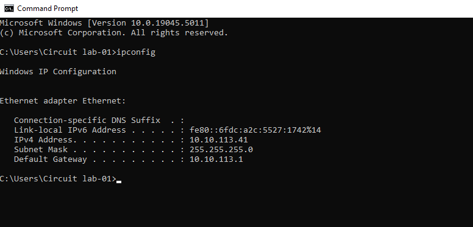

This code would try to send the PPM reading of the ESP32 to the php script via http request using the WiFi. Then, the php script shall receive the PPM value and send it to database!

If the http is not establihsed properly, we shall see 'httpCode: -1' like the following image:
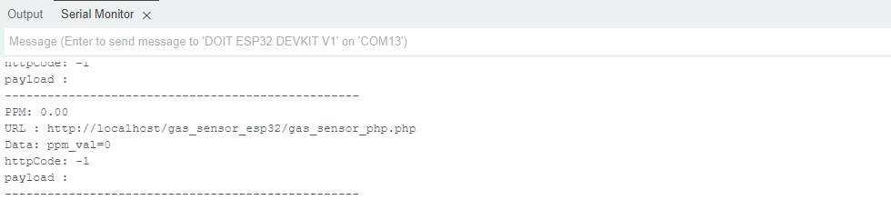
This can happen for various reasons!

However, after successful connection, the 'httpCode: 200' should be shown which means successful connection as shown in the following image:
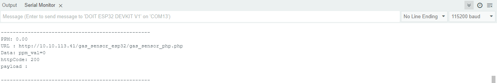

This means that the PPM value is now saved into the database successfully! 

For more in depth knowledge and procedures on how we are establishing the XAMPP with the ESP32, and what's the php script to final arduino code means, you can look at the experiments We designed (Me and my colleagues at UIU) in this following link: [View PDF](Exp2_IoT_ESP32.pdf)