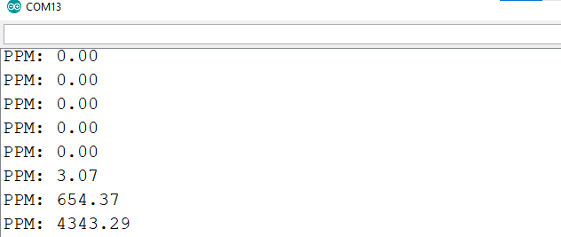

# How to Read Data from MQ-2 Gas Sensor with ESP32

## Overview
This section describes how to read analog data from the MQ-2 gas sensor using the ESP32 and convert the readings to an approximate PPM (parts per million) value.

### Hardware Required
- **ESP32 Microcontroller**
- **MQ-2 Gas Sensor**
- **Connecting Wires**

### Circuit Diagram
MQ-2 gas sensor has three 4 pins: VCC, GND, A0 (Analog Outpin PIN), D0 (Digital Output PIN). A0 gives the gas level detected the sensor and D0 gives 1 when specified gases (certain gases can be detected using MQ-2) are detected by the sensor or 0 if no gas is detected. For more about MQ-2 gas sensor, please look into the following links:
[MQ-2 Basics](https://lastminuteengineers.com/mq2-gas-senser-arduino-tutorial/)

Below, we show the connection of the MQ-2 Gas Sensor with ESP32.

 
<figcaption style="text-align: center;">Figure 1. Circuit Diagram (Hardware Implementation)</figcaption>

### Step 1: Connecting the Sensor
- Connect the **analog output (A0)** of the MQ-2 sensor to an analog pin on the ESP32 (e.g., GPIO13).
- MQ-2 requires 5V to work properly. Connect **VCC** to VIN of the ESP32. As we are powering the ESP32 via USB port, we can use the VIN pin to power up the MQ-2 sensor.
  However, if we are powering the ESP32 with 3.3V or VIN PIN, it's better to power up the MQ-2 with the main 5V power supply where both external power supply and ESP32 grounds are connected.
- Connect **GND** to the ground pin of the ESP32.

### Step 2: Reading Analog Data as well as the converted PPM value from the Analog Data
Using the Arduino IDE, write code to read analog data from the sensor. Refer to the ESP32 code in [esp32_gas_sensor.ino](../code/esp32code-arduino-ide/esp32_gas_sensor.ino).

The MQ-2 sensor provides raw analog data, which can be converted to an approximate PPM value based on calibration factors. This is done using a simple calculation within the ESP32 code.

Initially, there was no gas, so the serial monitor showed PPM value: 0, as shown in the following Figure 2:

 
<figcaption style="text-align: center;">Figure 2. PPM value reading shown in the serial monitor of the Arduino IDE initially</figcaption>

After a few moment, when gas is exerted surrounding the sensor, the PPM value starts to increase as shown in the following Figure 3:

 
<figcaption style="text-align: center;">Figure 3. PPM value reading shown in the serial monitor of the Arduino IDE after gas is exerted surrounding the sensor</figcaption>

### Now, the main question is how we are converting Analog Data to PPM value??
MQ-2 gas sensor doesn't provide the PPM value for the gases, only their corresponding Analog value. So, how to convert these Analog value to PPM value? For that we need to look into the datasheet of the MQ-2. 